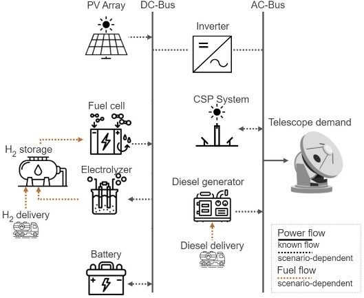

# ENERGY SYSTEM MODELS FOR PGO

A repository for storing energy system code files used in the PGO project.

> Conceptual and analytical modeling of energy systems for remote locations.

## Overview
This project explores the development of energy system models for a Polar Geospace Observatory. The focus is on representing power demand, storage, and system behavior under harsh operational conditions.

## Scope
- Modeling of PGO energy consumption.
- Resource analysis of renewable energy generation.
- System-level analysis of energy flow.
- Controller design and optimization.

- Exploration of efficient and resilient configurations

## Status
🚧 This project is currently in an early conceptual stage.
No implementation has been developed yet.

## Maintainer
Bilal Babar, Researcher,
Department of Technology Systems,
University of Oslo.

## References

1. Isabelle Viole, Guillermo Valenzuela-Venegas, Marianne Zeyringer, Sabrina Sartori,  
   *A renewable power system for an off-grid sustainable telescope fueled by solar power, batteries and green hydrogen*,  
   Energy, Volume 282, 2023, 128570.  
   https://doi.org/10.1016/j.energy.2023.128570

2. Viole, Isabelle, et al.  
   *Sustainable astronomy: A comparative life cycle assessment of off-grid hybrid energy systems to supply large telescopes.*,  
   The International Journal of Life Cycle Assessment, 29.9 (2024): 1706–1726.  
   https://doi.org/10.1007/s11367-024-02288-9

3. Viole, I., Valenzuela-Venegas, G., Sartori, S., & Zeyringer, M. (2024).  
   *Integrated life cycle assessment in off-grid energy system design—Uncovering low hanging fruit for climate mitigation.*,  
   Applied Energy, 367, 123334.
   
   https://doi.org/10.1016/j.apenergy.2024.123334

## Usage

Add or update energy system models and analysis scripts in this repository.

## Notes

This is a repo for energy system development in PGO. Add documentation and examples as the project grows.
